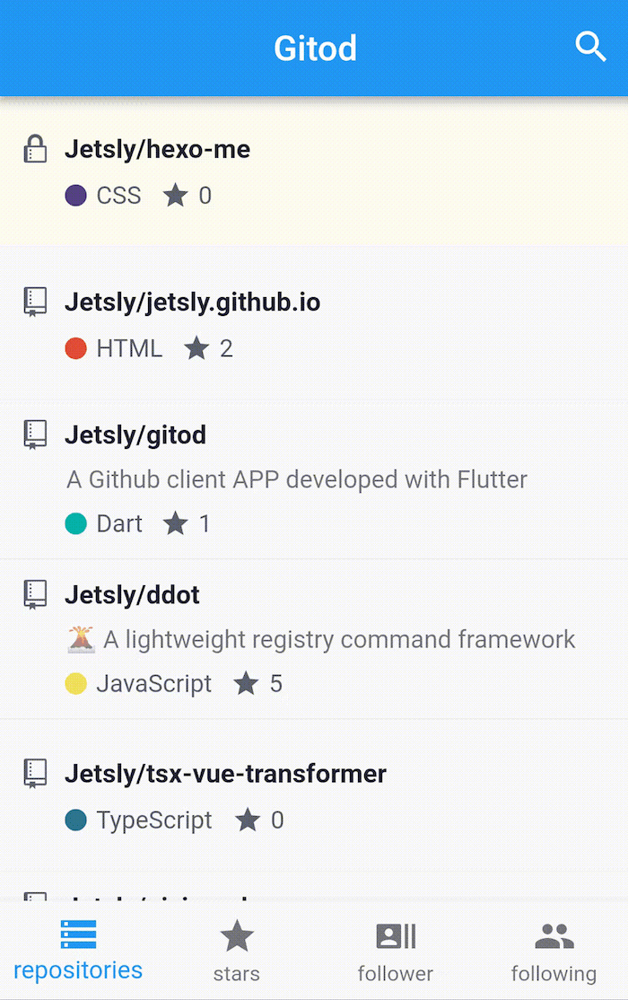

# gitod

## screenshot



## helps

- [graphql explorer](https://developer.github.com/v4/explorer/)
- [Icons](https://material.io/tools/icons/)
- [Icons-class](https://docs.flutter.io/flutter/material/Icons-class.html)

## authorize

- [authorize](https://github.com/login/oauth/authorize?scope=notification%2Cgist%2Cuser%2Crepo&client_id=19fb0f456308a43db1b6&redirect_uri=https://me.ddot.ink/gitod/)

## release

- [android](https://flutter.io/docs/deployment/android)

```flutter build apk```